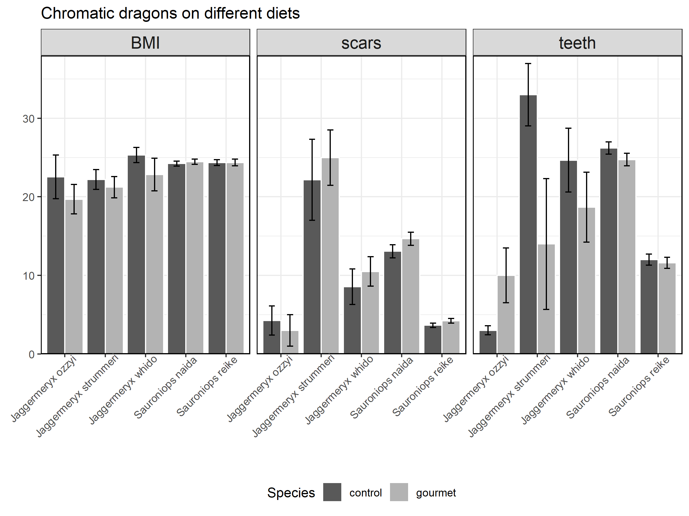
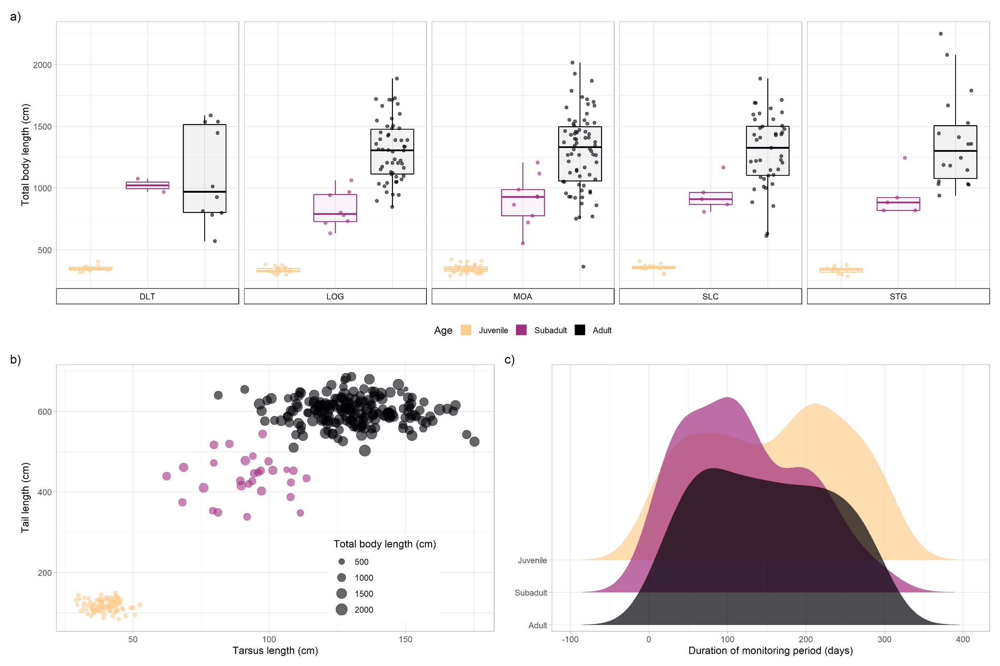
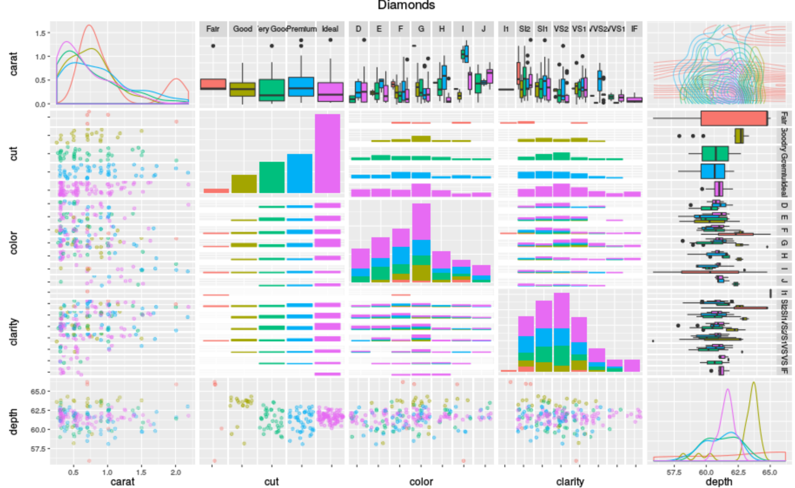

```{r, include=FALSE}
knitr::opts_chunk$set(fig.align = 'center',
                      out.width = '100%')
```

*FIRST*: Many thanks to Britta Schumacher for originally compiling these materials, and to Dr. Simona Picardi’s ggplot chapter, & Dr. Alison Horst’s tidyverse [aRt](https://github.com/allisonhorst/stats-illustrations).

# What is ggplot2?

<center> 

 

</center>

`ggplot2` is the data visualization package within the `tidyverse`; it takes clean, organized, manipulated data, and (with your direction) builds beautiful, & more importantly, *communicative*, plots. `ggplot2` is based on the *grammar of graphics*, which asserts that we can build every graph from the same few components: 

1) a clean and tidy **data set**; 
2) a set of **geometries** that map out data points;  
3) a **coordinate system** (in the broadest sense; ie. how will the data be mapped onto a graphical surface). 

To actually display data values, we map out our variables to aesthetic things like **size**, **color**, and **x** and **y** locations; we also tell `ggplot2` the type of visualization we are interested in building (e.g., bar graph, box plot, line graph, density plots, etc.). `ggplot2` opens up [data science](https://r4ds.had.co.nz/introduction.html) to broader audiences and helps all of us communicate our science. Download [this](https://www.rstudio.com/wp-content/uploads/2015/03/ggplot2-cheatsheet.pdf) cheat sheet and save it somewhere accessible--it's an incredible tool to refer back to!

`ggplot2` works with  `data.frames` (`tibbles`), the data type we built in our previous `tidyverse` workshop. The data we feed into `ggplot2` consists of rows and columns that "live peacefully" together in a tidy `data.frame`. This means, often, we need to do some data cleaning up front to get our data into the *tidy* format we need for visualization.


# Review of tidyverse concepts
What follows is a *brief* review of some core tidyverse functions and their use for tidying and manipulating our data so that it plays nice with ggplot. We will use a real*ish* dataset containing information on dragons (courtesy of the `DALEX` package). This is the same data we used on the previous tidyverse workshop.


## Load the tidyverse and other packages:
In honor of [Black Dragon Canyon Wash](https://www.alltrails.com/trail/us/utah/black-dragon-wash-trail--3), let's pretend we're trying to understand how different species of chromatic dragons (a decently [tempermental](https://en.wikipedia.org/wiki/Dragon_(Dungeons_%26_Dragons)) critter) with various life lengths compare in terms of number of scars and BMI. 
```{r warning = FALSE, message = FALSE}
#install.packages("DALEX")
library(tidyverse)     # ggplot2 and more; or library(ggplot2)
library(DALEX)         # for data
library(RColorBrewer)  # for nice color palettes

data(dragons)
view(dragons)
```


## Explore:

We should first familiarize ourselves with the data. 
```{r, eval = FALSE}
dim(dragons)      # view dimensions of the df
head(dragons)     # view first 10 rows of df
tail(dragons)     # view last 10 rows of df
str(dragons)      # view data structure of df
colnames(dragons) # view the columns of df
```

## Wrangle:

Let's quickly brush up on wrangling and clean up this data set for our purposes. We will:

a. filter for black & blue dragons  
b. select relevant columns of data 
c. rename columns  
d. create new columns  
e. combine genus and species into a single column
f. create categorical variable to group dragons by age!

Let's create an efficient workflow by combining **ALL** of these data wrangling steps; i.e., let's review harnessing the great POWERS of the `tidyverse` and pipes!

```{r}
# recall how we clean and manipulate data

dragons_simple <- dragons %>% 
  filter(colour %in% c("black","blue")) %>% # filter for blue & back dragons
  # select only relevant columns (height, weight, scars, colour, number_of_lost_teeth, and life_length)
  select(2:5,7, life_length) %>%  
  # rename columns with terribly long names
  rename(teeth = number_of_lost_teeth,
         age = life_length) %>% 
  # create new columns, "genus", based on colour ... and "species", based on colour and age
  mutate(genus = if_else(colour %in% c("blue"), "Sauroniops", "Jaggermeryx"), 
         species = case_when(
              colour == "blue" & age < 1200 ~ "reike",
              colour == "blue" & age > 1200 ~ "naida",
              colour == "black" & age < 1000 ~ "ozzyi",
              colour == "black" & (age >= 1000 & age <= 1700) ~ "whido",
              colour == "black" & age > 1700 ~ "strummeri")) %>% 
  # create new column, BMI (formula = (weight*2000)/0.45359237 / height^2)
  mutate(BMI = (weight*2000)/0.45359237 / height^2) %>% 
  # combine genus and species into one column
  unite(genus_species, genus, species, sep = " ") %>%  
  # create categorical variables to group dragons by age
  mutate(age_group = as.factor(case_when(
              age < 1000 ~ "dragonling",
              age >= 1000 & age <= 2000 ~ "juvenile",
              age > 2000 ~ "adult")))
```

With this simplified and cleaned data set, we're ready to start visualizing!


# Making Plots!
As we said before, ggplot needs 3 things: 1) tidy **data**, 2) a set of **geometries** (`geoms`), 3) a **coordinate system** (`aes` mappings). 

First box checked! More details on the second and third:

* **Geometries** are functions that create the *shapes* of your data (think points, lines, boxplots, histograms). They control the essential backbones of the graphical elements. These functions start with `geom_`.

* The **coordinate system** (or **mappings**) can be thought of as how those shapes are organized. It tells your shapes *what data to use and how*. These mappings are assigned with calls to `aes()`, which can be done two major ways.

There are other functions, which I will call "**customizers**," which allow us to tweak the display of our data in myriad ways. The most prominent of these are *themes*, *labels*, *scales*, and *guides.* Multiple graphical elements (including `geoms` and customizers) can be added to the ggplot in any order, separated by `+`.


## Scatterplot
Starting simple, we can make a scatterplot of the height and weight of our dragons.

Let's plot only the rare species though (ie., NOT Sauroniops naida or Sauroniops reike), so we don't have so many points.
```{r}
scatter_data <- dragons_simple %>% 
  filter(genus_species!="Sauroniops reike" & genus_species!="Sauroniops naida")
```

Now let's make just the basic scatterplot of all our rare dragons.
```{r}
# base scatterplot
ggplot(scatter_data, aes(x = weight, y = height)) +
  geom_point()
```

We can also color-code by species by using the `genus_species` column as an additional `aes()` mapping.
```{r}
# color-coded points
ggplot(scatter_data, aes(x = weight, y = height, color = genus_species)) +
  geom_point()
```

Cool! Now we have all the data we want to show, but the plot is still pretty rough around the edges. Let's fix the legend, labels, and axis scales (which are common tasks for any publication figure) ... and make the points a little easier to see too.
```{r}
# make it pretty
ggplot(scatter_data, aes(x = weight, y = height, color = genus_species)) +
  geom_point(size = 3) + # points bigger
  labs(title = "Chromatic dragon size by species", color = "Species", 
       x = "Weight (tons)", y = "Height (meters)") + # add labels 
  #adjust scales and colors (make colorblind-friendly)
  scale_x_continuous(limits = c(10,17), 
                     breaks = seq(10,17,2)) +
  scale_y_continuous(breaks = seq(30,70,5)) +
  scale_color_manual(values = c('#1b9e77', '#d95f02', '#7570b3')) +
  theme_bw() + # change the theme and move the legend
  theme(legend.position = c(0.8,0.25))
```

```{r}
# save this for later
scatter <- last_plot()
```


## Boxplots
Now let's look at a different part of the data, and make a set of boxplots that show the range of teeth lost by each species.

First, just the basic boxplot for all species grouped together.
```{r}
# make one boxplot for all dragons
ggplot(dragons_simple, aes(y = teeth)) +
  geom_boxplot()
# NOTE: the numbers on the unspecified (x) axis are meaningless, ignore for now
```

Similar to using color for points in the scatterplot, ggplot can also break up our data for us in boxplots. Let's make it a series of boxplots by using the `genus_species` column as an additional `aes()` mapping.
```{r}
# make a boxplot for each species
ggplot(dragons_simple, aes(x = genus_species, y = teeth)) +
  geom_boxplot()
```

... and we can make this prettier with some color and "customizers!"
```{r}
# make it pretty
ggplot(dragons_simple, aes(x=genus_species, y=teeth, fill=genus_species)) +
  geom_boxplot() + # make a boxplot
  labs(x = "", y = "Teeth Lost", fill = "Species") + # fix labels
  scale_fill_brewer(palette = 'Dark2') + # same colors as before 
  theme_minimal() + # change the preset theme
  theme(legend.position = "bottom") + # move legend to the bottom
  guides(fill = guide_legend(nrow=2)) # give legend two rows
```

```{r}
# save this for later
boxes <- last_plot()
```


## Column graphs (not the same as "bar graphs")
For this exercise, we will randomly assign our dragons to different diets and plot some trait summaries by species and diet. Let's first isolate data we want to visualize by:

a. grouping observations by genus_species & diet
b. finding the mean and SE for scars, BMI, and number of teeth for each species-diet combination
c. `pivot_longer()` into long format for visualizing
d. joining means and SEs together

```{r}
set.seed(121) # to ensure everyone gets the same random numbers

means <- dragons_simple %>% 
  # randomly assign diet groups
  mutate(random = runif(nrow(.),0,1),
         diet = if_else(random>=0.5,'control','gourmet')) %>%
  # group by age group and species
  group_by(diet,genus_species) %>% 
  # summarize mean scars, BMI, and teeth lost
  summarize(scars = mean(scars),
            BMI = mean(BMI),
            teeth = mean(teeth),
            .groups='drop') %>% 
  # pivot_longer() to format for column graph
  pivot_longer(cols = c(scars, BMI, teeth), 
               names_to = "summary_var", values_to = "mean_value") 
  
ses <- dragons_simple %>% 
  # randomly assign diet groups
  mutate(random = runif(nrow(.),0,1),
         diet = if_else(random>=0.5,'control','gourmet')) %>%
  # group by age group and species
  group_by(diet,genus_species) %>% 
  # summarize sd scars, BMI, and teeth lost
  summarize(scars = sd(scars, na.rm=T)/sqrt(n()),
            BMI =   sd(BMI, na.rm=T)  /sqrt(n()),
            teeth = sd(teeth, na.rm=T)/sqrt(n()),
            .groups='drop') %>% 
  # pivot_longer() to format for column graph
  pivot_longer(cols = c(scars, BMI, teeth),
               names_to = "summary_var", values_to = "se_value")

bar_data <- left_join(means, ses, 
                     by=c('diet','genus_species','summary_var'))
```

Now that we have our data summarized and in the right format, we're ready to make a plot! We want to:

a. create a column graph showing the summaries by species and diet
b. create a different panel for each trait summary
c. put some error bars on those!
c. make it pretty


<center>

Our goal is something like this:


</center>

To create the bones of the plot, we will need `geom_col()` like before, but we will have to combine it with **facets**, which essentially create multiple plots with the same geometries, but using different subsets of data. 
```{r}
ggplot(bar_data, aes(x = genus_species, y = mean_value, fill = diet)) +
  facet_wrap(~summary_var) + # create separate panels for each trait
  geom_col() + # separate columns for each age group
  geom_errorbar(aes(xmin=mean_value-se_value, 
                    xmax=mean_value+se_value))
```

There are several things wrong with this plot... What can we do about them?.. Might have to dig into some of the arguments for the geometries...
```{r, eval=FALSE}
?geom_col
?geom_errorbar
```

Ah ha! So we had a typo (probably from copying code from Stack Exchange) and it looks like the default `position` argument is a little wacky for our purposes. What should it be?
```{r}
ggplot(bar_data, aes(x = genus_species, y = mean_value, fill = diet)) +
  facet_wrap(~summary_var) + # create separate panels for each trait
  # separate columns for each age group - now dodged instead of stacked
  geom_col(position = 'dodge') + 
  geom_errorbar(aes(ymin=mean_value-se_value,  #change that "x" to a "y"
                    ymax=mean_value+se_value),
                position = position_dodge(0.9), width=0.3)

# NOTE: trying position = "dodge" and width = 1 might tell you something about what is going on under the hood
```

Now that we have the actual graph looking correct, we can customize it:

1) set our desired theme and color scheme
2) move legend to bottom
3) resize strip labels, remove redundant axis labels, and add title
4) do something about those terrible species labels
5) eliminate gap on the bottom of plot

```{r}
ggplot(bar_data, aes(x = genus_species, y = mean_value, fill = diet)) +
  facet_wrap(~summary_var) + # create separate panels for each trait
  geom_col(position = 'dodge', color='white') + # separate columns for each diet
  geom_errorbar(aes(ymin=mean_value-se_value, 
                    ymax=mean_value+se_value),
                position = position_dodge(0.9), width=0.3) +
  labs(title = "Chromatic dragons on different diets", x = "", y = "", 
       fill = "diet") + # add labels
  scale_y_continuous(expand = c(0,0,0,1)) + # adjust space on top and bottom
  scale_fill_manual(values = c('grey35','grey70')) + # change colors
  theme_bw() + # change the theme
  theme(legend.position = 'bottom',
        axis.text.x = element_text(angle = 45, hjust = 0.9),
        strip.text = element_text(size = 14))
```
Looks pretty close to our goal, doesn't it!

```{r}
# save this for later
bar <- last_plot()
```


# Multipanel figures with `Patchwork`
The following is adapted from materials designed by Simona Picardi [here](https://github.com/EcoRepSci/reproducible-science).

<center>


</center>

The package `patchwork` is a ggplot extension that allows you to combine and 
arrange multiple plots into a single plot with several panels. Let's load in 
the package (after installing it):

```{r, warning=FALSE, message=FALSE}
#install.packages("patchwork")
library(patchwork)
```

The first step to combine different plots is to store each plot by assigning
it its own name. Each will be stored in the environment as a `ggplot2` 
object. For example, let's take our plots from earlier and call them 
`p1`, `p2`, and `p3`:

```{r}
p1 <- scatter
p2 <- boxes
p3 <- bar
```

The syntax for arranging plots uses combinations of three symbols: `+`, `/`, and `|`. 
Using `+` is the simplest option and it can be combined with the `plot_layout` 
function to tweak how many rows and columns the plots are arranged on (among 
other things). If no layout is specified, plots are aligned in row order:

```{r}
p1 + p2 + p3 
```

Specify 2 rows:
```{r gg36, eval = TRUE, echo = TRUE}
p1 + p2 + p3 + plot_layout(nrow = 2)
```

We can enforce hierarchy/groups with parentheses:
```{r}
p1 + (p2 + p3) + plot_layout(nrow = 2)
```

The symbol `|` means "side by side" and the symbol `/` means "one on top of
each other". We can combine these to obtain any layout we want:

```{r}
p1 | p2 / p3
(p1 | p2) / p3
(p1 / p2) | p3
```

Here is an example of more `patchwork` functionality. Added panel tags, and used `ggplot2` `guides` to create a universal legend:



# Saving plots

You probably want to occasionally save your plots for later viewing or publication. 
It may be be tempting to save a plot by clicking *Export* on the RStudio plot
panel. This way is crude and frustrating. Instead, use `ggsave`! `ggsave` is 
the `ggplot2` function that allows you to save your plots and specify exactly 
how they will appear in the end. By default, if you don't assign a name to a plot and specify its
name in `ggsave`, it will assume you want to save the last plot you ran. 

This is the breakdown:

```{r}
ggsave(filename = "./out-plots/dragon_patchwork.tiff", 
       device = "tiff", # tiff or pdf for saving publication-quality figures
       width = 14, # define the width of the plot in your units of choice
       height = 8, # define the height of the plot in your units of choice
       units = "in", # define your units of choice ("in" stands for inches)
       dpi = 400) # you can control exactly how many dots per inches your plot has, which comes in handy when the journal guidelines have a specific requirement
```


# Plots, plots, plots, plots, plots, plots, plots!

There are just about a bazillion different ways to visualize the same data:

<center>



</center>

... In the end we just have to choose the method that makes the most sense for our audience, our research questions and our data!

Additionally, aRtists everywhere are using R to make ridiculously cool pieces of [generative](https://en.wikipedia.org/wiki/Generative_art) and patterned art. Check out some talented RLadies [here](https://ijeamaka-anyene.netlify.app/) and [here](https://djnavarro.net/projects/)! Plus, [#TidyTuesday](https://github.com/rfordatascience/tidytuesday) submissions can be [absolutely](https://tanyadoesscience.com/project/tidytuesday/), [wildly](https://martindevaux.com/2021/01/tidytuesday-art-collections/), [brilliantly](https://codingwithavery.com/posts/2020-08-12-tidy-tuesday-avatar/), good.


# Bonus

What's *especially* neat about `ggplot2` is that it interfaces seamlessly with `sf`, a package for spatial data wrangling, analysis, and viz.`sf` treats its spatial objects as `data.frames` meaning.... we can use all of the magic & power of the `tidyverse` to play with the data! Plus, these data look just like any other data.frame, except attached to them is a column `geometry` that houses the coordinate information for the observation!

Below, we'll take the the EPA air quality data Ellie & Dakoeta gathered and make it spatial for visualization!

```{r warning = FALSE}
# install.packages("sf") # if you haven't done so already!
library(sf)

# read in the data
epa <- readRDS("./in-data/alldata_1980_2020.RDS")

# let's explore a bit
dim(epa) # view dimensions of the df
glimpse(epa) # view the data structure and first few observations
str(epa) # view data structure of df
colnames(epa) # view the columns of df

# give this data.frame real dates!
dates <- data.frame(str_split_fixed(epa$date_local, "-", n = 3)) %>%
  rename(year = X1,
         month = X2,
         day = X3)

# bind year, month, day columns to epa data.frame
epa <- bind_cols(dates, epa)

# build_spatial 
epa_sf <- st_as_sf(x = epa, 
                        coords = c("longitude", "latitude"),
                        crs = "+proj=aea +lat_0=0 +lon_0=-120 +lat_1=34 +lat_2=40.5 +x_0=0 +y_0=-4000000 +datum=NAD83 +units=m +no_defs")

glimpse(epa_sf) # notice the new column, geometry

# visualize
epa_sf %>% filter(year == 2019, event_type == "None") %>% 
ggplot(.) +
  geom_sf(aes(color = aqi)) +
  theme_bw()
```

There are many, many ways to make maps beautiful in `ggplot` using `sf`. Anyone who says R isn't built for spatial viz just hasn't tried hard enough--check out [this](https://timogrossenbacher.ch/2019/04/bivariate-maps-with-ggplot2-and-sf/) if you don't believe me (just about the most gorgeous, creative, and well-built map I've ever seen).


# More Resources
* [ColorBrewer](https://colorbrewer2.org) and the [RColorBrewer](https://cran.r-project.org/web/packages/RColorBrewer/RColorBrewer.pdf) package for testing and creating color palettes (especially colorblind and greyscale-friendly ones)
* Emily Burchfield's data viz materials, [here](https://www.emilyburchfield.org/courses/data_viz/intro_to_ggplot_tutorial).
* [Secrets of a happy graphing life](https://stat545.com/secrets.html).
* [The ggplot2 cheatsheet!](https://www.rstudio.com/wp-content/uploads/2015/03/ggplot2-cheatsheet.pdf)
* Chapters 5 - 12 in [this online textbook](https://clauswilke.com/dataviz/visualizing-amounts.html) provide a great overview of when to use different visualization strategies.
* For more generative aRt, as well as several useful ggplot extension packages, check out artist and developer Thomas Lin Pederson at [data-imaginist.com](https://www.data-imaginist.com/art).

